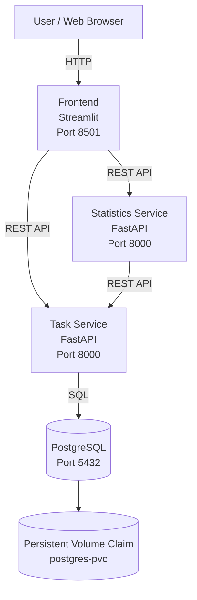

# TaskFlow — Kubernetes Microservices Project

TaskFlow is a deliberately small cloud-native task manager designed to demonstrate REST APIs, Docker, Kubernetes, independent horizontal scaling, service-to-service communication, PostgreSQL, and persistent storage.

## Components

- **Frontend**: Streamlit browser interface.
- **Task Service**: FastAPI REST service for creating, reading, updating and deleting tasks.
- **Statistics Service**: FastAPI REST service that programmatically calls Task Service and calculates totals.
- **PostgreSQL**: separate database service.
- **PVC**: keeps PostgreSQL data across pod restarts.

## Architecture Diagram



Only the frontend is externally exposed. The Task Service, Statistics Service, and PostgreSQL use internal Kubernetes ClusterIP Services.

## REST endpoints

Task Service:
- `GET /health`
- `POST /tasks`
- `GET /tasks`
- `GET /tasks/{id}`
- `PUT /tasks/{id}`
- `DELETE /tasks/{id}`

Stats Service:
- `GET /health`
- `GET /stats`

## Local test

```powershell
docker compose up --build
```

Open `http://localhost:8501`.

## Docker images

```powershell
docker build -t anishaguddeti/taskflow-task-service:1.0 ./task-service
docker build -t anishaguddeti/taskflow-stats-service:1.0 ./stats-service
docker build -t anishaguddeti/taskflow-frontend:1.0 ./frontend

docker push anishaguddeti/taskflow-task-service:1.0
docker push anishaguddeti/taskflow-stats-service:1.0
docker push anishaguddeti/taskflow-frontend:1.0
```

## Kubernetes deployment

```powershell
kubectl apply -f kubernetes/all.yaml
kubectl get pods -n taskflow
kubectl get services -n taskflow
kubectl get pvc -n taskflow
```

For local access:

```powershell
kubectl port-forward -n taskflow service/frontend 8501:8501
```

Open `http://localhost:8501`.

## Independent scaling

```powershell
kubectl scale deployment task-service --replicas=3 -n taskflow
kubectl scale deployment stats-service --replicas=3 -n taskflow
kubectl get pods -n taskflow
```

PostgreSQL intentionally remains one replica.

## Persistence

Task data is stored in PostgreSQL using the `postgres-pvc` PersistentVolumeClaim. Replacing the PostgreSQL pod does not remove the stored tasks.

## Security

Only the frontend is externally exposed. Backend services and PostgreSQL use ClusterIP. Database configuration is supplied through a Kubernetes Secret. The application containers run as non-root and use resource limits and health probes.

For production, add TLS/HTTPS, authentication and authorization, NetworkPolicies, stronger secret management, image scanning, monitoring, audit logging, and database backups.

## Coursework note

This is coursework. Review the course GenAI policy before submission and make sure every component and design decision can be explained during assessment.
